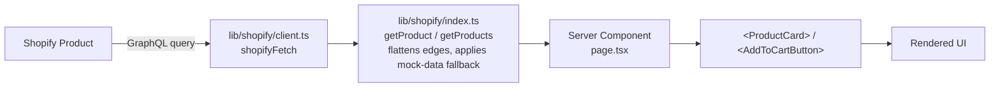
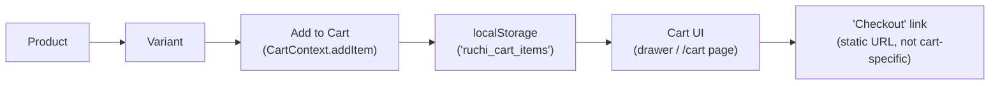

# Data Flow

## Product data flow

- **Product retrieval:** by handle (`getProduct(handle)` — PDP), by list with optional search `query` string (`getProducts({ query })` — catalog and header search-pill links), or scoped to a collection (`getCollectionProducts({ handle })`).
- **Product handles:** Shopify's native `handle` field is used directly as the Next.js dynamic route segment (`/products/[handle]`).
- **Product IDs:** Shopify GID strings (e.g. `gid://shopify/Product/1`) are used as React `key`s and as the `merchandiseId`/variant IDs passed to cart mutations.
- **Data transformation:** `removeEdgesAndNodes()` (private helper in `lib/shopify/index.ts`) flattens Shopify's `{ edges: [{ node }] }` GraphQL connection shape into plain arrays for the React layer.

## Cart data flow (as actually wired in the live UI)

This is **not** the same as the Shopify-backed cart flow the codebase also implements but does not use — see [Cart](../03-shopify/cart.md) for the full comparison and why this distinction matters.

See also: [Products](../03-shopify/products.md), [Shopify Architecture](shopify.md).
