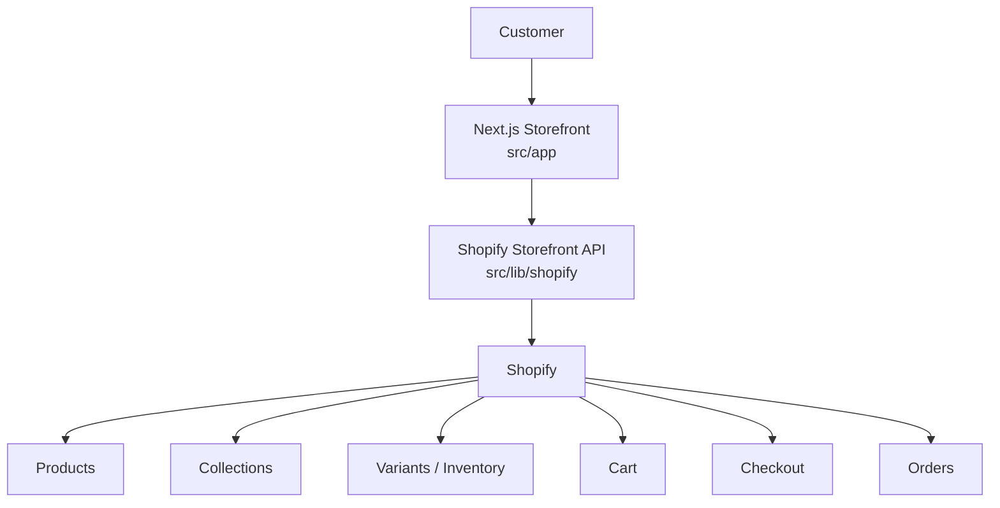

# System Architecture

## Components confirmed present

- Next.js App Router frontend (`src/app`)
- Shopify Storefront GraphQL client ([src/lib/shopify/client.ts](../../../src/lib/shopify/client.ts))
- Shopify product/collection/cart queries & mutations ([src/lib/shopify/queries.ts](../../../src/lib/shopify/queries.ts), [mutations.ts](../../../src/lib/shopify/mutations.ts))
- Server Actions for the Shopify cart ([src/lib/shopify/cart-actions.ts](../../../src/lib/shopify/cart-actions.ts))

## Components confirmed NOT present

Per the "no separate backend" mandate, and confirmed by inspecting `package.json` and the full `src/` tree:

- No custom database (no Prisma, Supabase, Firebase, MongoDB, Postgres client, etc.)
- No custom backend server (no Express, no custom API routes under `src/app/api`)
- No custom payment or order-storage logic
- No Customer Account API integration — see [Customer Accounts](../03-shopify/customer-accounts.md)
- No CMS integration

## A layer that exists in code but is disconnected from the UI

The Shopify-backed cart (Server Actions + Storefront Cart API mutations) is fully implemented but not reachable from any component currently rendered by the app. This is significant enough to warrant its own document: see [Cart](../03-shopify/cart.md).

See also: [Frontend Architecture](frontend.md), [Shopify Architecture](shopify.md), [Data Flow](data-flow.md).
