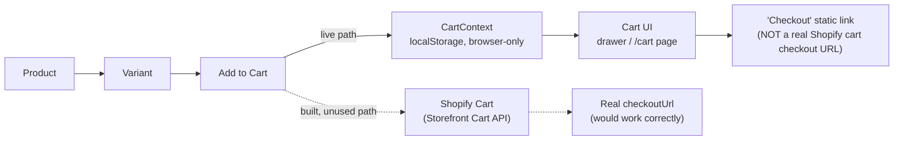

# Cart System

**This is the most important architectural fact in this handbook.** The codebase contains **two independent, non-interoperating cart implementations.** A new developer must understand both before making any cart-related change. This directly contradicts the project's own design brief, which explicitly states *"DON'T: Build duplicate commerce systems"* ([docs/RUCHI-FOODLINE-DESIGN-KNOWLEDGE.md](../05-design-system/original-design-brief.md) §37).

## 1. The system actually used by the live UI: client-side `CartContext`

File: [src/components/cart/cart-context.tsx](../../../src/components/cart/cart-context.tsx)

- A React Context (`CartProvider`, mounted in [src/app/layout.tsx](../../../src/app/layout.tsx)) holding cart line items in `useState`, persisted to **`localStorage`** (`ruchi_cart_items` key) — **not Shopify.**
- `addItem(product, variantId?, quantity?)` builds a `LocalCartItem` from whatever `Product` object is passed to it. This can be a *real* Shopify product from `getProducts()`, or — in the case of the PDP's `<AddToCartButton>` — a **synthetic/fabricated `Product` object built client-side** just to satisfy the function signature (see the `dummyProduct` in [add-to-cart-button.tsx](../../../src/components/product/add-to-cart-button.tsx)).
- Consumed by: [header.tsx](../../../src/components/layout/header.tsx) (cart icon count, opens the drawer), [cart-drawer.tsx](../../../src/components/cart/cart-drawer.tsx) (slide-in cart), [product-card.tsx](../../../src/components/product/product-card.tsx) ("Add to cart" on every card), [add-to-cart-button.tsx](../../../src/components/product/add-to-cart-button.tsx) (PDP), and [app/cart/page.tsx](../../../src/app/cart/page.tsx) (the `/cart` route).
- **Checkout from this cart** links to `process.env.NEXT_PUBLIC_SHOPIFY_CHECKOUT_URL`, falling back to the hardcoded string `https://ruchi-foodline.myshopify.com/checkout` if that env var is unset. **This URL carries no line-item information** — it is a static link, not a Shopify-generated `checkoutUrl` tied to an actual cart. `NEXT_PUBLIC_SHOPIFY_CHECKOUT_URL` is **not documented in [.env.example](../../../.env.example)**.

## 2. The system implemented but disconnected from the UI: Shopify Storefront Cart API

Files: [src/lib/shopify/cart-actions.ts](../../../src/lib/shopify/cart-actions.ts), [src/components/cart/cart-line-item.tsx](../../../src/components/cart/cart-line-item.tsx), [src/components/cart/checkout-button.tsx](../../../src/components/cart/checkout-button.tsx)

- `cart-actions.ts` is a complete, correct implementation: an httpOnly/secure/`sameSite=lax` `cartId` cookie (30-day max-age), `getOrCreateCart()`, and four Server Actions (`addItemAction`, `updateItemQuantityAction`, `removeItemAction`, `redirectToCheckoutAction`) that call the real `cartLinesAdd`/`cartLinesUpdate`/`cartLinesRemove`/`cartCreate` Shopify mutations and redirect to Shopify's real, cart-specific `checkoutUrl`.
- `CartLineItem` and `CheckoutButton` are React components built to render this Shopify-backed cart.
- **Grep-confirmed: neither component is imported by any other file in the repository, and none of the four Server Actions are called from any component currently rendered in the app.** This is dead code from the live user's perspective — correct, but unreachable.

## Practical implication

The Shopify Cart API path (solid-line alternative in the diagram) exists in code and is correct, but is not reachable from the UI as currently wired. **Whichever path a developer chooses to keep, the other should either be finished and wired in, or removed** — see [Modifying Cart](../08-development/modifying-cart.md) and [Coding Guidelines](../08-development/coding-conventions.md).

## Other cart facts

- **Persistence:** localStorage only (client cart) — cleared if the user clears browser storage, not shared across devices/browsers. The Shopify cart's cookie-based persistence (30 days, httpOnly) is unused.
- **Totals:** computed client-side in `CartContext` (`subtotal = Σ price × quantity`), including a hardcoded ₹499 free-shipping threshold and ₹49 flat shipping fee — **these are UI-only numbers, not sourced from Shopify shipping/tax configuration.**
- **Cart count:** `totalQuantity` from `CartContext`, shown as a badge on the header cart button.
- **Error handling:** the client cart has no error states (it's pure local state; a `localStorage` write failure is silently swallowed with `catch { /* ignore */ }`). The Shopify-cart Server Actions do have proper error handling (`isShopifyApiError` checks, returned as `{ error }`), but this path is not currently exercised by the UI.

See also: [Checkout](checkout.md), [Cart Pages](../06-pages/cart.md), [Modifying Cart](../08-development/modifying-cart.md), [Known Gaps](../11-roadmap/known-gaps.md).
