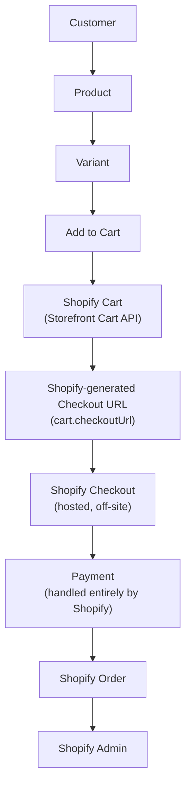

# Checkout & Order Flow

## As designed / intended (and as the disconnected `cart-actions.ts` path implements correctly)

## As currently wired in the live UI

The customer's cart lives only in `localStorage` (see [Cart](cart.md)), and the "Checkout" button/link goes to a static, non-cart-specific URL. **This means the currently-deployed-looking UI cannot reliably carry a customer's selected items into a real Shopify checkout and order today.** This is the single highest-priority item for the next development pass — see [Known Gaps](../11-roadmap/known-gaps.md).

## Division of responsibility

- **What the frontend controls:** presentation, product browsing, and (in the unused path) cart line management up to the point of redirecting to Shopify.
- **What Shopify controls:** payment processing, tax calculation, shipping-rate calculation, discount application, and order creation. None of this is duplicated in the frontend.
- **How checkout is initiated:** intended to be a redirect to Shopify's hosted checkout (`cart.checkoutUrl`), via `redirectToCheckoutAction()` in `cart-actions.ts` — currently unreachable from the UI.
- **Why the frontend does not create orders directly:** by design — there is no order-creation code anywhere in this repository, consistent with the "Shopify is the single source of truth" mandate.

See also: [Cart](cart.md), [Customer Accounts](customer-accounts.md), [Modifying Cart](../08-development/modifying-cart.md).
