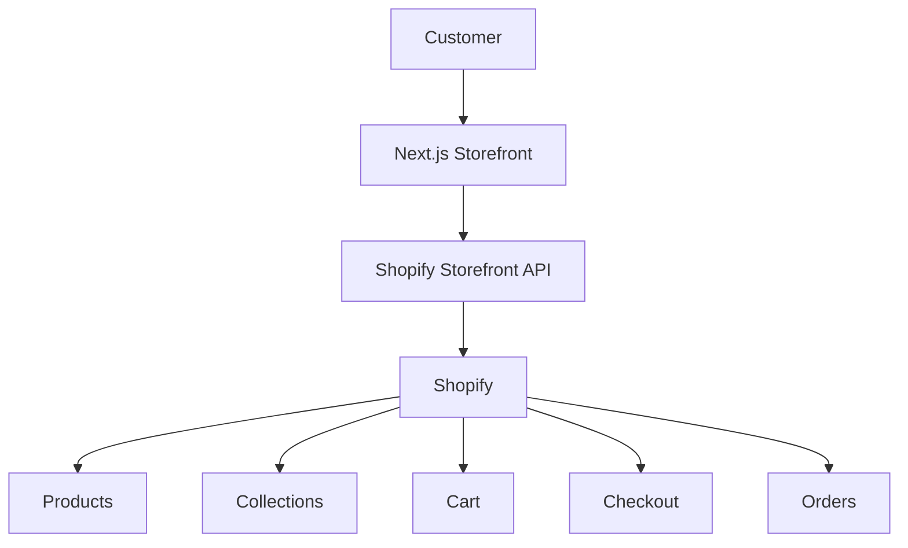

# Ruchi Foodline — Engineering Handbook

This is the engineering handbook for the **Ruchi Foodline storefront**: a Next.js (App Router) frontend backed entirely by the Shopify Storefront API, with no custom backend or database. It documents the architecture, the Shopify integration, the design system, and how to develop, maintain, and deploy the project — based on direct inspection of the codebase as it exists today, not on assumptions.

## What this handbook is built from

Every technical claim in this handbook is traceable to one of two sources:

1. **The actual codebase** — the technical source of truth. Every file path, component name, and behavior described here was verified by reading the code, not inferred from convention.
2. **[The original design brief](05-design-system/original-design-brief.md)** — the project's written visual/design specification, treated as *intent*. Where the implementation diverges from it, this handbook says so explicitly, because those gaps are some of the most actionable findings in the whole project.

Anything that couldn't be verified from either source is explicitly marked **"Not verified in the current codebase."**

## What Ruchi Foodline is

An Indian FMCG brand (spices, blended masalas, pasta/vermicelli, ready-mix products) with a custom-built ecommerce storefront that presents Shopify-catalogued products and hands off to Shopify for cart/checkout/payment. See [Project](01-overview/project.md) for the full picture.

## Why the architecture exists



**Shopify controls:** products, variants, prices, inventory, collections, cart, checkout, orders, customers, discounts.

**Next.js controls:** UI, layout, navigation, page composition, presentation, and the responsive/animated experience.

Neither layer duplicates the other's job — see [System Architecture](02-architecture/system.md) for the full breakdown of what's present, and (importantly) what's deliberately absent.

## Current project status, in one paragraph

The homepage, product catalog, product detail pages, and collection pages are built and working against real (or mock-fallback) Shopify data. **Cart and checkout are in an inconsistent, partially-wired state** — the codebase contains two separate cart implementations, and only one of them is actually reachable from the UI, and it doesn't yet carry real cart contents to Shopify checkout. This is the single most important thing to understand before writing any code here. Full detail: [Cart](03-shopify/cart.md) and [Known Gaps](11-roadmap/known-gaps.md).

## How to navigate this handbook

The sidebar is organized in the order a new developer would actually need it:

| Order | Section | What you'll find |
|---|---|---|
| 1 | **Overview** | What this project is, why it's built this way, the tech stack |
| 2 | **Architecture** | System-, frontend-, and Shopify-level architecture, data flow, rendering strategy |
| 3 | **Shopify** | Every Shopify concept this app touches — products, collections, cart, checkout, and what's deliberately not implemented (customer accounts, metafields) |
| 4 | **Frontend** | Next.js specifics — routing, components, data fetching, state, performance, error handling |
| 5 | **Design System** | Typography, color, spacing, shape, and component rules — compared against the original design brief chapter by chapter |
| 6 | **Pages** | Every route in the app, section by section |
| 7 | **Content** | What content comes from Shopify vs. hardcoded in React, and where |
| 8 | **Development** | Local setup, environment variables, workflow, and how to safely extend the app |
| 9 | **Deployment** | What's configured (mostly nothing yet), and what to set up |
| 10 | **Maintenance** | Troubleshooting, security, performance, accessibility, monitoring |
| 11 | **Roadmap** | Current status, known gaps (categorized), technical debt, future features |
| 12 | **Reference** | Cheatsheet, component/Shopify API tables, glossary, decision log |

## Suggested first read, in order

```
Project Overview  →  Local Setup  →  System Architecture  →
Shopify Overview  →  Frontend Architecture  →  Design System Overview  →
Cart (read this before writing any cart code)  →  Deployment
```

Start with [Project](01-overview/project.md).
